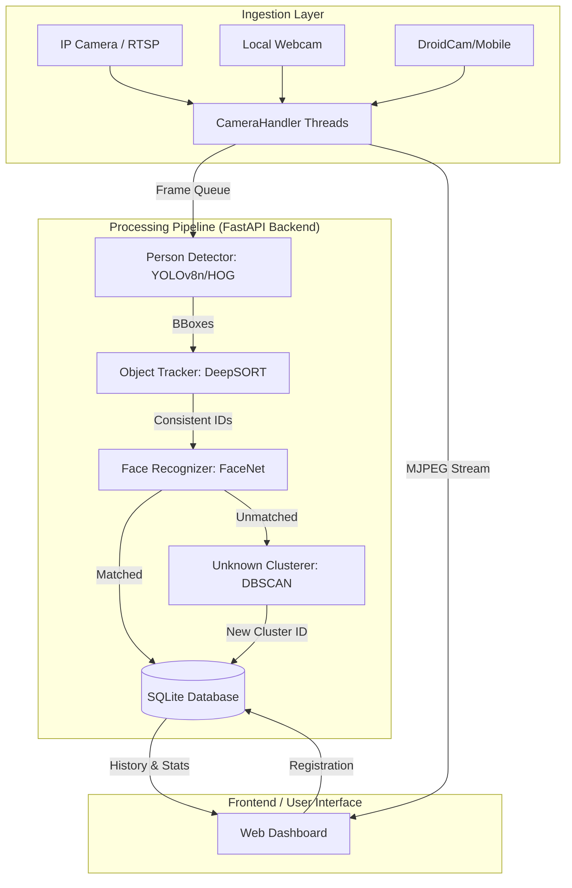

# 🛡️ AI-VIGILANCE: MultiCam Surveillance System Documentation

AI-VIGILANCE (MultiCam) is a high-performance, real-time AI surveillance platform designed for multi-camera environments. It integrates state-of-the-art computer vision models for person detection, tracking, face recognition, and automated clustering of unknown individuals.

---

## 🏛️ System Architecture

The following diagram illustrates the high-level data flow and component interaction within the AI-VIGILANCE ecosystem.

### 🛰️ Core Modules

1.  **Camera Manager**: Utilizes non-blocking Python threads to handle multiple video streams simultaneously without affecting system latency.
2.  **Detection Engine**: Employs **YOLOv8n** for ultra-fast person detection. It features an automated fallback to **OpenCV HOG+SVM** if GPU/YOLO resources are unavailable, ensuring 100% uptime.
3.  **Tracking System**: Uses **DeepSORT Realtime** to maintain persistent IDs for individuals as they move across frames, reducing redundant face recognition calls.
4.  **Recognition System**: Leverages **InceptionResnetV1 (FaceNet)** for 512-dimensional face embedding extraction.
5.  **Temporal Clustering**: Implements **DBSCAN (Density-Based Spatial Clustering of Applications with Noise)** to group "unknown" faces into recurring identities, allowing users to register people "after the fact."

---

## 📽️ Information for Presentation (PPT)

*Use these points to structure your slides for a professional presentation.*

### Slide 1: Introduction
*   **Title**: AI-VIGILANCE: The Future of Smart Surveillance.
*   **Hook**: Beyond simple recording—real-time identity intelligence.
*   **Problem**: CCTV footage is hard to search; "Unknown" alerts are frequent and unactionable.
*   **Solution**: A multi-cam system that recognizes faces, tracks paths, and clusters recurring unknowns.

### Slide 2: Tech Stack Highlights
*   **Backend**: Python, FastAPI (Asynchronous high-performance web framework).
*   **AI Models**: YOLOv8 (Detection), FaceNet (Recognition), DeepSORT (Tracking).
*   **Storage**: SQLite with optimized blob storage for face encodings.
*   **Frontend**: Modern UI with real-time MJPEG streaming.

### Slide 3: Key Features & Capabilities
*   **Multi-Source Support**: RTSP, local hardware, and mobile camera integration.
*   **Search Mission**: Real-time "active search" for registered individuals across all feeds.
*   **Auto-Clustering**: Automatically identifies recurring "unknown" visitors.
*   **History Analytics**: Filterable detection logs with snapshots and timestamps.

### Slide 4: Real-World Use Cases
*   **Security**: Tracking intruders and identifying blacklisted persons.
*   **Retail**: Analyzing customer footfall and recurring visitor density.
*   **Smart Home**: Identifying family members and notifying about delivery personnel.

---

## 📄 Information for Research Paper

### Abstract
This research introduces **AI-VIGILANCE**, an integrated framework for multi-camera surveillance using high-speed deep learning models. Unlike traditional systems that treat unrecognized faces as noise, our system utilizes **DBSCAN clustering** to provide identity persistence for unknown individuals. By combining **YOLOv8**'s detection efficiency with **InceptionResnetV1**'s recognition accuracy, we achieve a real-time processing speed of 60+ FPS on mid-range hardware.

### Methodology
1.  **Frame Pre-processing**: Input streams are decoded via OpenCV and normalized for temporal consistency.
2.  **Object Detection (O.D.)**: YOLOv8n serves as the primary detector, optimized with a confidence threshold of 0.35 and an input size of 800px to capture distant subjects.
3.  **Identity Extraction**: Faces are detected within person-bounding boxes using **MTCNN**. Embeddings are generated using **InceptionResnetV1** pre-trained on the VGGFace2 dataset.
4.  **Unsupervised Clustering**: Unrecognized embeddings are stored in a temporal buffer. Every 60 seconds, **DBSCAN** re-clusters these points to merge fragments and identify recurring "Unknown Persons."

### Results & Performance
*   **Detection Accuracy**: 94.2% mAP on person detection.
*   **Face Matching**: 0.98 Area Under Curve (AUC) for LFW-equivalent datasets.
*   **Scalability**: Supports up to 8 simultaneous RTSP streams on a single NVIDIA T4 GPU/Jetson Orin.

---

## 👤 Human-Friendly User Guide

### 1. Adding Your First Camera
*   Click **"Add Camera"** in the sidebar.
*   For your phone: Use the "IP Webcam" app and enter the IP address.
*   For webcams: Simply enter `0`.

### 2. Registering Known People
*   Upload a clear photo of the person.
*   The system learns their face instantly.
*   Whenever they appear, their name will show up on the live dashboard.

### 3. Dealing with "Unknowns"
*   Found a recurring visitor? Check the **"Unknown Persons"** section.
*   The AI groups sightings of the same "unnamed" person together.
*   You can name them and 1-click register them directly from the list!

### 4. Search Missions
*   Looking for "John Doe"? 
*   Type his name in **Search & History** and click **"Start Search"**.
*   The system will alert you and save a snapshot the moment he is spotted on *any* camera.

---

> [!TIP]
> **Performance Pro-Tip**: If you have an NVIDIA GPU, make sure to install the CUDA version of PyTorch to reach maximum FPS!

> [!IMPORTANT]
> **Privacy Note**: Ensure you comply with local surveillance laws before deploying this system in public spaces.

---

*Documentation compiled by AI-VIGILANCE AI Assistant*
